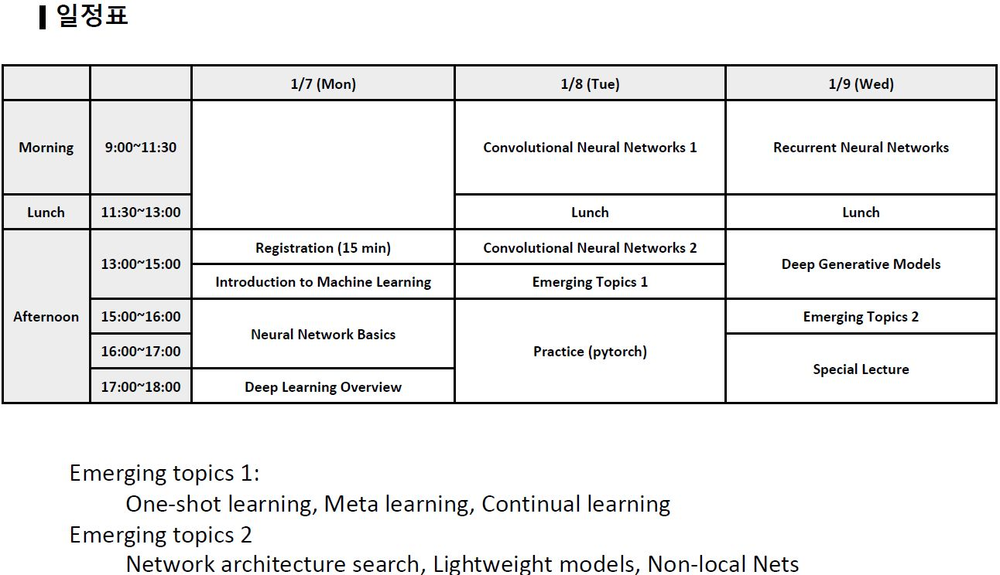

2019년 겨울 한동머신러닝캠프 강의 동영상
======================================

* 강사: 한동대 전산전자공학부 김인중 교수
* 시간: 2019년 1월 7-9일
* 장소: 한동대학교 뉴턴홀 313호
* 강의자료: [2019년 한동머신러닝캠프 강의자료_통합](2019_HGU_ML_Camp_LectureNote.pdf).

8개의 강의로 구성되며 각 강의 동영상은 다음과 같습니다.

1. Introduction to Machine Learning
https://youtu.be/xKhYmlgC7j8

2. Neural Network Basics
https://youtu.be/Bxe_meOt8f8

3. Deep Learning Overview
https://youtu.be/MYeYgz6hNuo

4. Convolutional Neural Networks
https://youtu.be/UY9vvd7DNCs

5. Emerging Topics (One-Shot Learning, Meta Learning, Continual Learning)
https://youtu.be/P5HtYNFshaw

6. Recurrent Neural Networks
https://youtu.be/4ov5dxdIIew

7. Deep Generative Models
https://youtu.be/rEnR2aZx53U

8. Emergint Topics 2 (Network Architecture Search, Lightweight Models, Non-local Neural Nets)
https://youtu.be/PP3uQdXltq4

